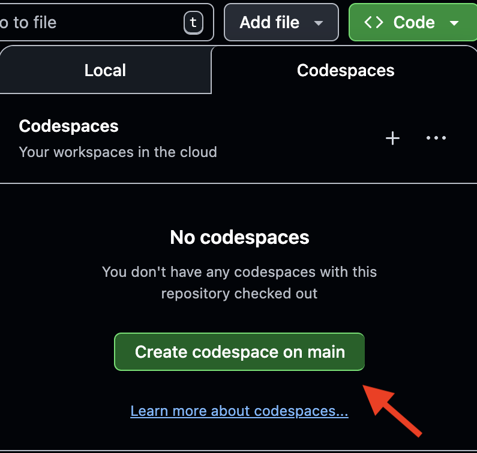
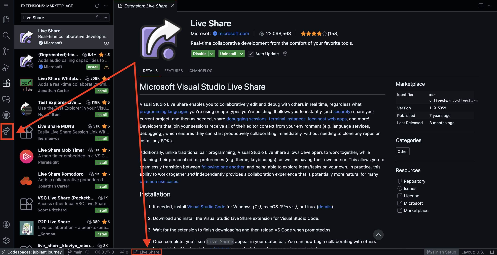

# Welcome to Your Coding Interview w/ SketchUp

> Trimble SketchUp is the most widely used 3D design environment in the world - delighting architects, interior designers, construction companies, woodworkers and hobbyists around the world. With more than a million subscribers - and many more users of our free offerings - being part of SketchUp is being part of a movement. 

To ensure we make the most of our time together, please complete the **Pre-Interview Setup** steps below **before** our scheduled call.

## Gettting Setup for your Interview

### Pre-Interview Setup

#### Prerequisites
* A GitHub Account (You must be logged in).
* Access to this repository URL.

#### Step 1: Create the Codespace
1.  Ensure you are logged into your GitHub account.
2.  Click the green **Code** button at the top right of the repo homepage.
3.  Select the **Codespaces** tab.
4.  Click **Create codespace on main**. 

   
  <i>It may take a few minutes for the environment to build and load in your browser.<i>

#### Step 2: Install Live Share
Once the VS Code editor loads in your browser:

1.  Click the **Extensions** icon (blocks on the left sidebar).
2.  Search for **"[Live Share](https://marketplace.visualstudio.com/items?itemName=MS-vsliveshare.vsliveshare)"**.
3.  If it is not installed, click **Install**. If it is already installed, ensure the extension is not disabled.

#### Step 3: Verification
* Locate the **Live Share** icon in the bottom left sidebar or status bar.
* If you see the liveshare icons, you are all set! You can close the tab; the Codespace will save your state.

   

## During the Interview
When you join the video call (Google Meet), please perform the following:

1.  **Open your Codespace:** Re-open this repository and launch the Codespace you created in Step 1.
2.  **Start Collaboration:**
    * Click the **Live Share** icon.
    * Click **Share**. A unique joining link will be available to copy.
    * *Important:* Ensure "Read-only" is **OFF**.
3.  **Share the Link:** Copy the link to your clipboard and paste it into the meeting chat for your interviewer.

**Your interviewer will provide further instructions on how to access the specific coding exercise once connected.**
